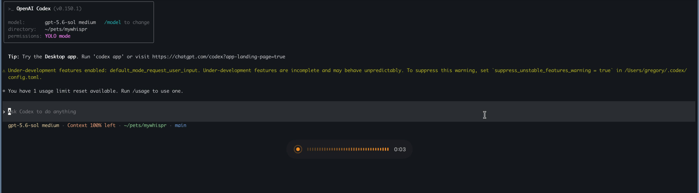
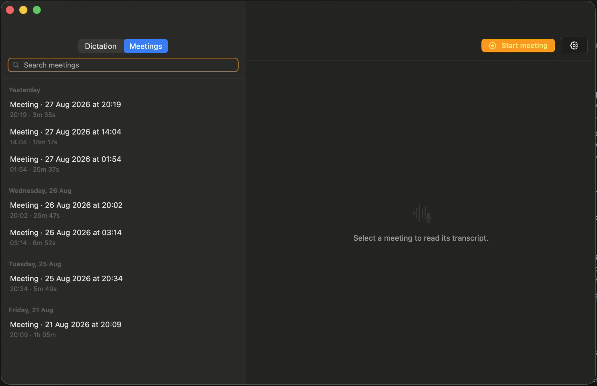

# MyWhispr

**Private, local speech-to-text for macOS — as a native app and a scriptable CLI.**

[](https://github.com/NmadeleiDev/mywhispr/actions/workflows/ci.yml)
[](https://www.apple.com/macos/)
[](https://www.swift.org/)
[](LICENSE)

MyWhispr turns speech into text entirely on your Mac. Hold a key to dictate into
any application, record and transcribe meetings with speaker separation, search
and edit your history, or transcribe existing audio files from the command line.
There is no account, cloud transcription, subscription, telemetry, or usage
limit.

MyWhispr is fully open source, fully open, and forever free. The application and
CLI are released under the permissive [MIT License](LICENSE), so you can inspect,
build, change, and redistribute them.

> **Project status:** MyWhispr is usable today but is still pre-1.0. The current
> build targets Apple silicon Macs running macOS 26 or newer.

## Demo

<p align="center">
  <a href="docs/media/dictation-demo.mp4">
    
  </a>
</p>

<p align="center">
  <strong><a href="docs/media/dictation-demo.mp4">▶ Watch the 9-second dictation demo</a></strong>
</p>

The demo shows the complete push-to-talk loop: hold the dictation key, speak while
the live HUD confirms recording, release, and have the transcript inserted at the
cursor.

<p align="center">
  
</p>

The native app keeps recorded meetings in a searchable, date-grouped history and
opens each one into its transcript, synchronized playback, summary, and local-AI
question view.

## Why MyWhispr

- **Private by design.** Speech transcription runs on-device after the selected
  model has been downloaded. MyWhispr has no account system, analytics, or cloud
  transcription path.
- **Native, not a web wrapper.** The app is built with SwiftUI, AppKit, Core
  Audio, AVFoundation, and Apple silicon acceleration.
- **Useful beyond dictation.** It records microphone and system audio as separate
  meeting tracks, produces a speaker-aware transcript, and keeps it searchable.
- **Two real interfaces.** Use the menu-bar app interactively or the same engine
  from a Unix-friendly command line.
- **Local AI is optional.** Faithful transcription works without a language
  model server. Ollama, LM Studio, and other loopback OpenAI-compatible servers
  can optionally polish dictation, summarize meetings, and answer questions.
- **No artificial limits.** There are no paid tiers, quotas, locked features, or
  hosted services required by the project.

## Capabilities

### Native macOS app

#### Dictation anywhere

- Hold the configurable push-to-talk key — Right Command by default — and
  release it to transcribe and insert text into the control that originally had
  focus.
- Capture the original target before recording, so the result goes back to the
  field where dictation began even if MyWhispr briefly becomes active.
- Insert through the macOS Accessibility API. If the target changed, is secure,
  or does not support direct replacement, copy the result instead. A clipboard
  paste compatibility path restores the previous clipboard contents when safe.
- Show live recording and processing state in an optional heads-up display and
  turn the menu-bar icon into a live audio meter while recording.
- Play optional start/stop cues and reject accidental key taps shorter than a
  configurable threshold.
- Enforce a configurable maximum dictation length so a stuck key cannot record
  indefinitely. Pressing another key while push-to-talk is held cancels the take.
- Remove filler sounds, repeated words, stutters, and false starts with a local,
  deterministic cleanup pass that does not paraphrase the speaker.
- Optionally polish punctuation and recognition slips with a local AI model.
  Rewriting has a configurable timeout and falls back to the faithful transcript
  if the model is unavailable or too slow.
- Delete successful dictation audio immediately. Failed audio is retained for 24
  hours so transcription can be retried without speaking again.

#### Dictation history and reuse

- Keep dictated text for no time, 7 days, 30 days, 90 days, or forever.
- Search recent dictations with full-text search.
- Read and edit retained text, inspect when and where it was dictated, and see
  which speech model produced it.
- Copy or insert any previous dictation again.
- Summon a keyboard-driven recent-dictation palette, filter it as you type, and
  insert the selected line back into the application you were using.
- Access the five most recent dictations directly from the menu-bar panel.

#### Meeting recording and transcription

- Start or stop a meeting from the app, menu bar, or a configurable global
  shortcut.
- Record microphone input and Mac system output as separate local CAF tracks
  without changing the selected output device.
- Display recording duration and live input level while capture is active.
- Transcribe after recording stops, skip a silent track instead of failing the
  whole meeting, and de-duplicate acoustic echo between microphone and system
  audio.
- Perform offline speaker diarization and merge both tracks into one timestamped,
  speaker-aware transcript.
- Preserve recordings before processing begins, show processing progress, mark
  interrupted work, and retry failed or interrupted transcription from the saved
  audio.
- Search meeting titles and transcript content with SQLite FTS5.
- Rename meetings and speakers, edit individual passages, select and copy text,
  copy the complete transcript, and delete meetings with confirmation.
- Play the two meeting tracks on one synchronized timeline. Click a transcript
  passage to seek, follow the active passage during playback, scrub the timeline,
  and use Space to play or pause when no text field is being edited.
- Keep recordings for playback or delete them automatically after successful
  transcription while retaining the transcript.

#### Optional local-AI tools

- Connect to Ollama or a loopback OpenAI-compatible endpoint such as LM Studio.
- Discover the models served by the configured endpoint and choose separate
  models for fast dictation rewriting and deeper meeting work.
- Generate meeting summaries on demand with an editable prompt; render the
  Markdown result and let it be edited, copied, stopped, or regenerated.
- Ask follow-up questions against an entire meeting transcript, including speaker
  names and timestamps. Answers stream into a persistent per-meeting conversation
  and can be stopped without discarding the text already received.
- Retry interrupted questions and clear a conversation without touching the
  transcript, summary, or recording.
- Estimate the context required by the full transcript, request an appropriate
  Ollama context window, and warn rather than silently truncating a meeting that
  exceeds the configured 8K–128K ceiling.
- Keep local-AI traffic on loopback by default. Network endpoints are rejected
  unless LAN access is explicitly enabled.

#### Models, language, and vocabulary

- Configure dictation and meetings independently: each workflow has its own
  engine, model, and language selection.
- Download models explicitly, see their download/on-disk size and license, cancel
  or retry downloads, reveal their files in Finder, and remove unused models.
- Prevent removal of a model while a workflow is assigned to it.
- Detect spoken language automatically or select one of the common languages in
  the app. The CLI accepts any supported language code.
- Maintain one shared vocabulary of names, jargon, and multi-word product terms.
  Close recognition misses are corrected back to the supplied spelling in both
  dictation and meetings; ambiguous matches are deliberately left unchanged.

#### macOS experience and controls

- Live primarily as a menu-bar app, with an optional Dock icon and optional launch
  at login.
- Configure or disable global shortcuts for meeting capture, recent-dictation
  insertion, and opening the main window; shortcut conflicts are surfaced in
  Settings.
- Use standard macOS editing commands, searchable sidebar history, native
  permission onboarding, and actionable permission/restart status.
- Inspect disk use for recordings, downloaded models, and the transcript database;
  reveal local storage in Finder or erase all retained content from the app.

### Command-line interface

The CLI transcribes one existing audio file locally without launching the
menu-bar interface. It accepts WAV, CAF, AIFF, MP3, M4A, FLAC, and Ogg-family
inputs. `.ogg`, `.oga`, and `.opus` containers may contain Vorbis, Opus, or FLAC
audio supported by AVFoundation.

```text
Usage:
  mywhispr transcribe <audio-file> [options]
  mywhispr <audio-file> [options]

Options:
  --engine <name>      fluid-audio (default) or whisper-kit
  --model <id>         Model to use; selecting one also selects its engine
  --language <code>    auto (default) or a language code such as en or de
  --format <format>    text (default) or json
  -h, --help           Show help
  --version            Show the version
```

Examples:

```sh
# Fast default model; stdout contains only the transcript.
mywhispr transcribe recording.ogg

# The `transcribe` subcommand is optional.
mywhispr interview.m4a --language en

# Selecting a model also selects its owning engine.
mywhispr lecture.wav --model small --language auto

# Select an engine and use its default model.
mywhispr meeting.caf --engine whisper-kit

# Structured, pretty-printed output for a script or pipeline.
mywhispr call.mp3 --model large-v3-v20240930_626MB --format json > transcript.json

# Paths beginning with a dash work after the option terminator.
mywhispr -- --unusual-filename.wav
```

On success, stdout contains only the transcript or requested JSON document.
Model-download progress and errors go to stderr. Invalid arguments return status
2; transcription/runtime failures return status 1. This separation makes the
command safe to use in pipelines and command substitution.

JSON output is the encoded `TranscriptionResult`: top-level `text`, optional
`detectedLanguage`, and `segments`. Each segment contains an ID, start/end times
in seconds, text, speaker label, and audio channel.

## Speech models

Models are downloaded on first use and then run locally. Sizes are approximate
download sizes; upstream model licenses remain their own.

| Model ID | Engine | Approx. size | Native app use | Notes |
| --- | --- | ---: | --- | --- |
| `parakeet-tdt-v3` | FluidAudio | 483 MB | Dictation, meetings | Fast multilingual default for dictation; Neural Engine optimized |
| `sensevoice-small` | FluidAudio | 472 MB | Dictation | Automatic detection across 50+ languages |
| `tiny` | WhisperKit | 77 MB | Dictation | Small, fast, useful for testing |
| `base` | WhisperKit | 147 MB | Dictation | Balanced multilingual dictation |
| `small` | WhisperKit | 486 MB | Dictation, meetings | Higher accuracy with moderate latency |
| `large-v3-v20240930_turbo` | WhisperKit | 1.64 GB | Dictation, meetings | Highest speed/accuracy option in the catalog |
| `large-v3-v20240930_626MB` | WhisperKit | 627 MB | Meetings | Compact Large v3 Turbo; default for meetings |

The CLI can select any model in the table. The app recommends only models suited
to each workflow. Offline speaker diarization downloads its own FluidAudio model
the first time it is needed.

## Install the macOS app from source

### Requirements

- Apple silicon Mac running macOS 26 or newer
- Full Xcode 26.6 or newer in `/Applications` (the Command Line Tools package by
  itself is not sufficient)
- Git
- Internet access for the initial Swift package and speech-model downloads
- Microphone and Accessibility permissions for dictation
- System Audio Recording permission for meeting system-audio capture
- Optional: Ollama, LM Studio, or another local OpenAI-compatible service for AI
  rewriting, summaries, and meeting questions

Input Monitoring permission is **not** required. Accessibility permission
authorizes the event tap used for the dictation key as well as insertion into the
focused text control.

### 1. Clone and test

```sh
git clone https://github.com/NmadeleiDev/mywhispr.git
cd mywhispr

# Use full Xcode if xcode-select currently points at CommandLineTools.
DEVELOPER_DIR=/Applications/Xcode.app/Contents/Developer swift test
```

If your Xcode application has a versioned filename, adjust `DEVELOPER_DIR` to
match it.

### 2. Build the application bundle

```sh
./scripts/build-app.sh
```

The script creates `dist/MyWhispr.app`, copies SwiftPM resources into the bundle,
adds the required entitlements, signs the result, and verifies the signature. It
uses `CODESIGN_IDENTITY` when supplied, otherwise Developer ID, Apple Development,
another available signing identity, or finally an ad-hoc signature.

To select an identity explicitly:

```sh
CODESIGN_IDENTITY="Apple Development: Your Name (TEAMID)" ./scripts/build-app.sh
```

A persistent signing identity is strongly recommended. macOS ties Microphone,
Accessibility, and System Audio Recording grants to the signed application
identity. With ad-hoc signing the identity changes after every rebuild, so macOS
will ask for those permissions again.

### 3. Run and grant permissions

```sh
open dist/MyWhispr.app
```

On first launch:

1. Follow the setup window to grant Microphone and Accessibility access.
2. If macOS granted Accessibility after the process started, use the app's restart
   action so the global dictation key can be registered.
3. Choose and download a dictation model. The default is Parakeet TDT v3.
4. Focus any editable text field, hold Right Command, speak, and release.
5. Start a meeting once to grant System Audio Recording when macOS requests it.

You can continue to run the app from `dist`, or move the completed
`MyWhispr.app` bundle to `/Applications` in Finder. If you move it after granting
permissions, macOS may ask you to confirm those grants for the new location.

## Install the CLI from source

The app and CLI are the same executable. The installer makes a release build and
atomically copies it to the user-owned `~/.local/bin` directory; it does not need
`sudo` and does not leave a symlink into SwiftPM's disposable `.build` directory.

```sh
./scripts/install-cli.sh
export PATH="$HOME/.local/bin:$PATH"
mywhispr --version
mywhispr --help
```

Add `~/.local/bin` to your shell's `PATH` permanently if it is not already there.
Rerun the installer after updating the repository. Packagers can override the
destination with `MYWHISPR_INSTALL_DIR`.

The executable inside the app bundle exposes the identical CLI without a separate
installation:

```sh
dist/MyWhispr.app/Contents/MacOS/MyWhispr transcribe recording.wav
```

## Privacy and local storage

What MyWhispr stores by default:

- Successful dictation audio: deleted immediately
- Failed dictation audio: retained for 24 hours for retry
- Dictation text: retained for 30 days, configurable from none to forever
- Meeting tracks, transcripts, edits, titles, summaries, and conversations:
  retained until deleted, unless meeting audio is configured for removal after
  transcription
- Search index: transcript and title content only; meeting questions are not added
  to search

Application data is stored under:

```text
~/Library/Application Support/MyWhispr/
```

FluidAudio models are stored under:

```text
~/Library/Application Support/FluidAudio/Models/
```

MyWhispr makes outbound connections only for model downloads you initiate and for
requests to the local-AI address you configure. Local-AI addresses are restricted
to this Mac unless you explicitly enable LAN access.

## Troubleshooting

### `swift test` cannot find `Testing`

Your active developer directory probably points at the standalone Command Line
Tools. Run the command with full Xcode:

```sh
DEVELOPER_DIR=/Applications/Xcode.app/Contents/Developer swift test
```

### Dictation permissions reset after every rebuild

The app was signed ad hoc. Add an Apple Development certificate in Xcode under
**Settings → Accounts → Manage Certificates**, or pass a stable identity through
`CODESIGN_IDENTITY`, then rebuild and grant permissions once more.

### The dictation key does nothing after granting permission

Use the restart action offered by MyWhispr. A running macOS process cannot always
recreate its event tap immediately after Accessibility is granted.

### Meeting transcription has no system-audio speaker

If nothing was playing, the system track is intentionally treated as silent and
skipped. If audio was playing, confirm MyWhispr has System Audio Recording access
in System Settings.

### A local-AI meeting question will not run

The complete transcript must fit in the configured context ceiling. Increase the
ceiling in **Settings → Local AI** if your model and available memory support it,
or choose a model/server configured with a larger context window.

## Architecture

MyWhispr is a Swift 6 SwiftPM executable under strict concurrency:

```text
Menu bar / AppKit windows / CLI
              │
          AppRuntime
       ┌──────┼───────────┐
       │      │           │
   Audio   Transcription  Local AI
       │      │           │
 Core Audio  FluidAudio   Ollama
 AVFoundation WhisperKit  OpenAI-compatible
       │      │           │
       └──── GRDB / FTS5 ─┘
```

- SwiftUI renders the menu-bar extra and view hierarchy; an AppKit coordinator
  owns windows so global hotkeys work even when no window exists.
- Core Audio process taps record system output; AVAudioEngine records the
  microphone.
- FluidAudio provides Parakeet, SenseVoice, and offline diarization. WhisperKit
  provides configurable Whisper-family models and long-form decoding.
- GRDB owns the SQLite store, migrations, and FTS5 search index.
- Realtime audio callbacks are `@Sendable` and do not touch main-actor state.
- The same executable selects GUI or CLI mode from its process arguments.

For third-party licenses and adapted-source attribution, see
[`ThirdPartyNotices.txt`](Sources/MyWhispr/Resources/ThirdPartyNotices.txt).

## Contributing

Bug reports, feature proposals, documentation improvements, tests, and code are
welcome. Start with [CONTRIBUTING.md](CONTRIBUTING.md), follow the
[Code of Conduct](CODE_OF_CONDUCT.md), and use the repository's issue forms.

Security vulnerabilities should be reported privately according to
[SECURITY.md](SECURITY.md), not in a public issue.

## License

MyWhispr is free and open-source software licensed under the
[MIT License](LICENSE). Copyright belongs to the individual MyWhispr
contributors. Third-party libraries and speech models retain their respective
licenses.
